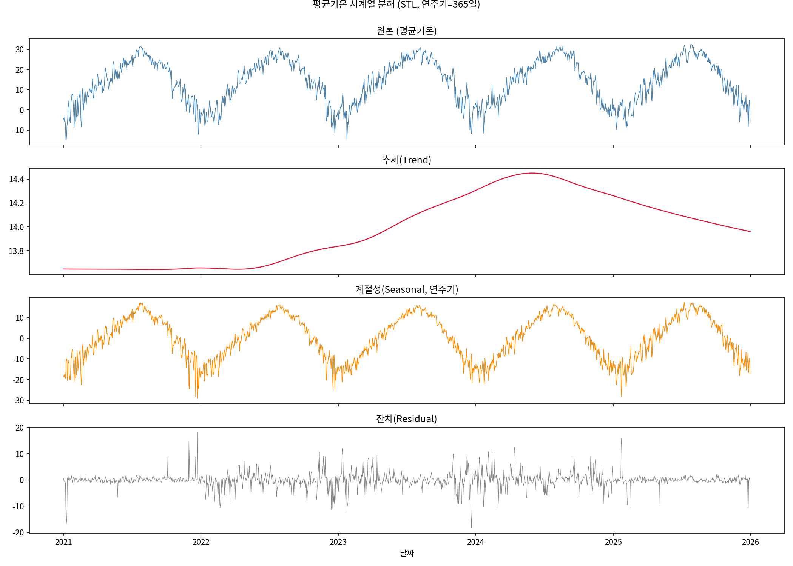
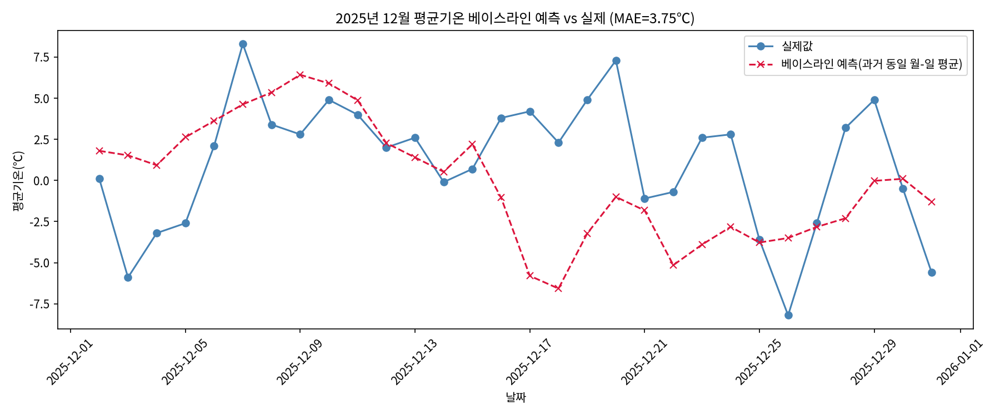

# 보너스 과제

## 보너스 1. 시계열 심화 옵션 — (A) 시계열 분해

STL(Seasonal-Trend decomposition using Loess)을 이용해 평균기온을 **추세(Trend) / 계절성(Seasonal) / 잔차(Residual)**로 분리했다. (연주기 365일 기준)

**해석**
- 추세(Trend): 2021년부터 2024년 중반까지 완만히 상승(13.65℃ → 14.46℃)했다가 이후 다시 소폭 하락(14.46℃ → 13.96℃)하는 모습을 보인다. 5년 전체로 보면 시작 대비 끝값이 **+0.31℃** 수준으로, 뚜렷한 장기 온난화 추세라고 단정하기엔 폭이 작다.
- 계절성(Seasonal): 진폭이 약 ±15~20℃로 매우 크며, 원본 변동의 대부분을 계절성이 설명하고 있다.
- 잔차(Residual): 표준편차 2.89℃로 원본 표준편차(10.70℃) 대비 27.0% 수준. 계절성과 추세를 제거하고 남은 "설명되지 않는 변동"이 이 정도 크기라는 뜻이며, 이 잔차의 튀는 지점들이 앞서 탐지한 이상기온과 상당 부분 겹친다.

**가정/한계**
- STL의 계절주기를 365일로 고정했는데, 실제 계절 전환 시점은 해마다 며칠씩 다를 수 있어 완벽히 들어맞지는 않는다.
- 5년치로는 "추세가 상승/하락 중이다"를 통계적으로 확정하기엔 표본 기간이 짧다.

## 보너스 1. 시계열 심화 옵션 — (B) 간단 예측 (베이스라인)

**방법**: 2025년 12월 마지막 30일(12/2~12/31)을 검증 구간으로 떼어놓고, 나머지 학습 구간(2021~2025-12-01)에서 **같은 '월-일'의 과거 평균값**으로 예측하는 가장 단순한 계절성 베이스라인을 적용했다.

**결과**: MAE 3.75℃, RMSE 4.72℃

**해석**
- 예측선은 매끄러운 반면 실제값은 하루 단위로 요동이 커서, 평년값만으로는 특정 연도의 단기 한파/이상고온을 잡아내지 못한다(예: 12/25 실제 -8.2℃ vs 예측 -3.6℃로 4℃ 이상 차이).
- 오차의 대부분은 "당일 종관 기상 상황(한파/온난 이류 등)"에서 오는데, 이는 단순 평년값 베이스라인이 원천적으로 반영할 수 없는 정보다.

**가정/한계**
- 이 예측은 정확도를 목표로 한 모델이 아니라 "가장 단순한 기준선은 이 정도 오차를 낸다"는 비교 기준(baseline)이다.
- 학습 구간에 검증 구간과 같은 연도(2025년의 다른 달)가 포함되어 있어 완전한 미래 예측 시나리오는 아니다. 엄밀한 예측이라면 2025년 전체를 검증에서 제외해야 한다.
- 추세(위 STL 분해에서 확인한 완만한 상승/하락)를 전혀 반영하지 않는 단순 평균이므로, 실제 이후 연도에 적용하면 편향이 생길 수 있다.

## 보너스 2. 분석 결과 서비스화 — 인터랙티브 대시보드

`dashboard.html` 1개 파일로 완결되는 웹 대시보드를 만들었다. 별도 서버나 인터넷 연결 없이 **더블클릭으로 브라우저에서 바로 열림**(라이브러리까지 파일 안에 내장).

**기능**
- 연도(전체/2021~2025) · 계절(전체/봄/여름/가을/겨울) 드롭다운으로 데이터를 실시간 필터링
- 필터에 따라 상단 요약 카드(선택 일수, 평균기온, 최고/최저, 평균 일교차, 이상기온 발생일)가 즉시 갱신
- 일별 평균기온 추이, 월별 평균기온, 계절별 일교차, 연도별 이상기온 발생일 4개 차트가 함께 갱신

**시나리오 예시**: 연도=2023, 계절=여름 선택 → 92일, 평균 25.8℃, 이상기온 3일(3.3%)로 즉시 집계되는 것을 확인함 (스크린샷 `dashboard_filtered_screenshot.png` 참고)

**실행 방법**: `dashboard.html` 파일을 더블클릭하거나 브라우저에 끌어다 놓으면 바로 실행됨 (인터넷 연결 불필요)

**제출 방식**: 로컬 실행 화면(스크린샷 2장: 전체 보기, 2023년 여름 필터링 보기)으로 제출 — `dashboard_screenshot.png`, `dashboard_filtered_screenshot.png`
