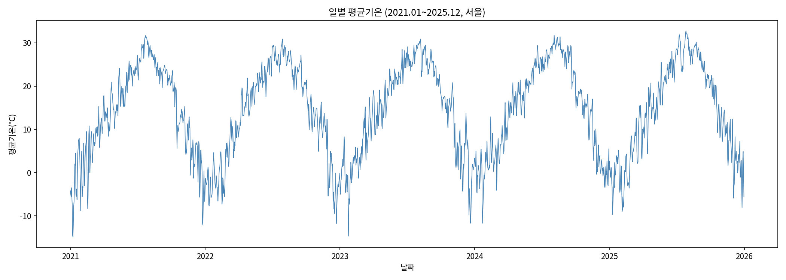
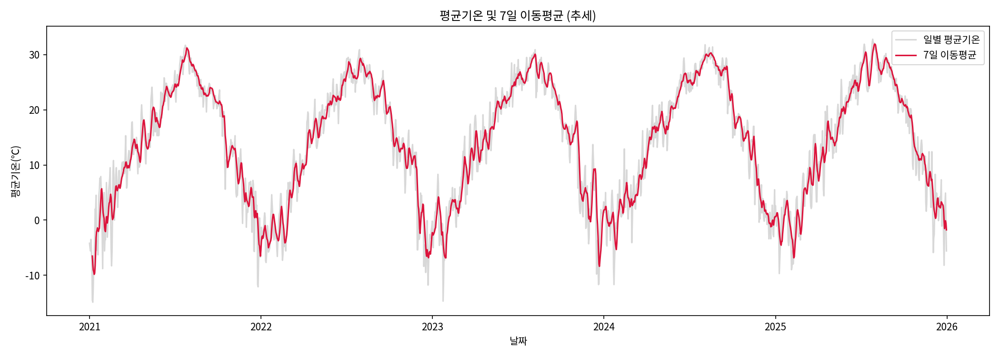
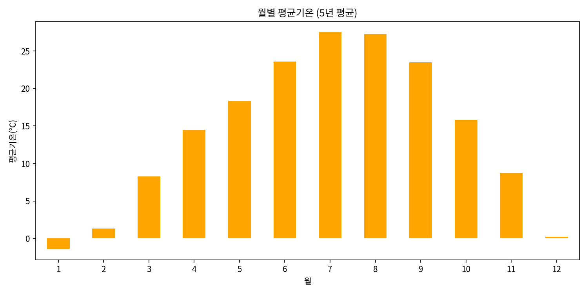
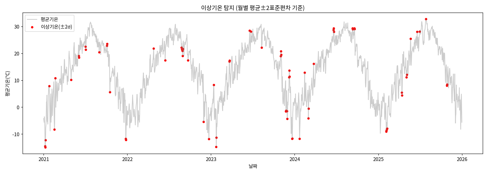
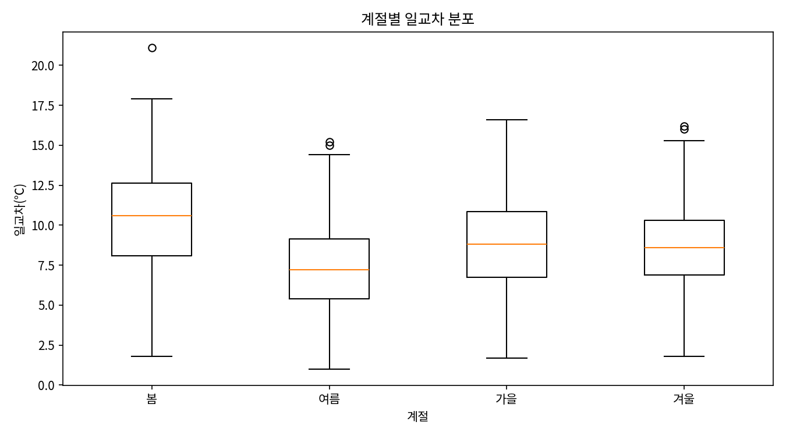
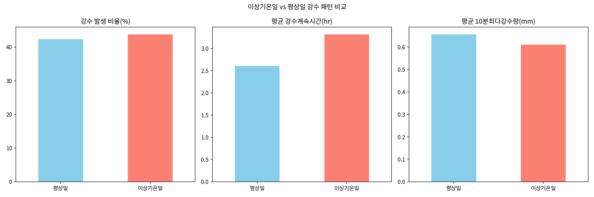

# 서울 일별 기온 데이터를 활용한 계절성 및 이상기온 트렌드 분석

## 1. 분석 주제 및 선정 이유

최근 몇 년간 폭염·한파 등 이상기온 뉴스가 자주 언급되지만, 실제로 수치 데이터에서
"계절성 안에서 얼마나 벗어난 값들이 얼마나 자주 나타나는지"를 직접 확인해본 적은 없었다.
서울 지점의 5년치 일별 기온 데이터를 통해 계절 패턴을 확인하고, 그 패턴에서 벗어난
이상기온 발생 시점과 강수와의 관계를 데이터로 직접 살펴보고자 이 주제를 선정했다.

## 2. 분석 질문 (5개)

1. (Q1, 추세) 서울 일별 평균기온은 최근 5년간 어떤 흐름을 보였는가?
2. (Q2, 계절성) 월별·계절별 기온 변화에는 어떤 패턴이 나타나며, 계절 간 차이는 얼마나 뚜렷한가?
3. (Q3, 이상기온) 같은 시기의 평년 기온 범위와 비교했을 때, 비정상적으로 덥거나 추웠던 시기는 언제였는가?
4. (Q4, 일교차) 일교차(최고기온-최저기온)는 계절별로 어떤 차이를 보이는가?
5. (Q5, 강수 관계) 이상기온 발생일과 강수 패턴(발생 빈도, 지속시간, 최다강수량) 사이에 관찰되는 관계가 있는가?

## 3. 데이터 설명

- 출처: 기상청 기상자료개방포털 (ASOS 종관기상관측, 일자료)
- 지점: 서울(108)
- 기간: 2021-01-01 ~ 2025-12-31 (총 1,826행, 5년치 일별 데이터)
- 컬럼: 날짜, 평균/최저/최고기온, 최저/최고기온 시각, 강수계속시간, 10분/1시간 최다강수량

### 결측치 처리
- 원본 결측치: 최저기온 1건, 강수계속시간 1,049건, 10분 최다강수량 1,320건, 1시간 최다강수량 1,320건
- 기온: 결측 0건(사실상 완전한 데이터)이라 보간 로직은 대비만 해두고 실제 적용 건수는 없었음
- 강수 관련 3개 컬럼: 결측을 전부 **0(무강수)으로 대체**함. 강수 데이터는 "관측 실패"가 아니라
  "비가 오지 않아 값 자체가 존재하지 않는 경우"가 대부분이라는 기상 데이터 특성을 반영한 처리 기준임

### 이상치 처리
- 1차(물리적 오류) 필터: 평균기온 -30~40℃ 범위, 최고기온<최저기온, 강수량 음수 여부를 확인 → **해당 건 0건**으로 명백한 오류는 없었음
- 2차(통계적 극값): 월별 평균±2표준편차를 벗어나는 값은 삭제하지 않고 "이상기온"으로 표시만 하여 Q3 분석의 재료로 그대로 사용함

## 4. 분석 결과 및 시각화

### 4-1. 기온 추세 (Q1)

5년간 뚜렷한 상승/하락 추세보다는 **매년 반복되는 계절 사이클(연교차 약 45~48℃)**이 지배적으로 나타난다.
7일 이동평균으로 단기 변동을 제거하면 계절 전환 시점(3월, 11월경)이 더 뚜렷하게 확인된다.

### 4-2. 계절성 (Q2)

여름철(6~8월) 평균기온은 **26.2℃**, 겨울철(12~2월) 평균기온은 **0.0℃**로 계절 간 차이가 26.2℃에 달한다.

### 4-3. 이상기온 탐지 (Q3)

5년간 이상기온(월별 평균±2σ 이탈) 발생일은 총 **73일(전체의 4.0%)**이며, 연도별로는
2021년 17일, 2022년 10일, 2023년 20일, 2024년 12일, 2025년 14일로 나타났다.
2023년이 가장 많고 2022년이 가장 적어, 5년 사이 뚜렷한 증가/감소 추세라기보다는 해마다 편차가 있는 것으로 보인다.

### 4-4. 계절별 일교차 (Q4)

계절별 평균 일교차는 봄 **10.3℃**, 가을 **8.7℃**, 겨울 **8.6℃**, 여름 **7.3℃** 순으로,
봄철 일교차가 가장 크고 여름철이 가장 작다.

### 4-5. 이상기온-강수 관계 (Q5)

- 강수 발생 비율: 평상일 **42.4%**, 이상기온일 **43.8%**
- 평균 강수계속시간: 평상일 **2.6시간**, 이상기온일 **3.3시간**
- 평균 10분 최다강수량: 평상일 **0.66mm**, 이상기온일 **0.61mm**

## 5. 인사이트 (5개)

**인사이트 1 — 계절 진폭이 매우 크다**
- 관찰(Fact): 여름 평균기온 26.2℃, 겨울 평균기온 0.0℃로 계절 간 차이가 약 26℃ (03번 그래프)
- 해석(가설): 대륙성 기후 특성상 여름 몬순과 겨울 대륙성 고기압의 영향이 뚜렷하게 반영된 것으로 보임
- 행동/제안: 이 폭을 기준선으로 삼으면 향후 "이상기온"의 절대적 체감 기준을 설명하기 쉬움

**인사이트 2 — 이상기온 발생은 연도별 증감 추세가 뚜렷하지 않다**
- 관찰(Fact): 연도별 이상기온 발생일수가 17→10→20→12→14일로 특정 방향의 추세 없이 등락함 (04번 그래프)
- 해석(가설): 5년이라는 기간이 기후변화 추세를 판단하기엔 짧아, 자연적인 연간 변동성 범위 안에 있을 가능성이 있음
- 행동/제안: 더 장기간(10년 이상) 데이터로 재검증 필요, 단기 데이터로 "증가 추세"를 단정하는 것은 주의해야 함

**인사이트 3 — 일교차는 여름보다 봄에 더 크다**
- 관찰(Fact): 봄철 평균 일교차 10.3℃로 4계절 중 가장 크고, 여름철은 7.3℃로 가장 작음 (05번 그래프)
- 해석(가설): 여름은 습도와 구름이 많아 밤낮 기온차가 완충되는 반면, 봄은 건조하고 일사량 변화가 커서 일교차가 커지는 것으로 추정
- 행동/제안: "환절기 감기 주의"라는 통념이 일교차 데이터로도 뒷받침됨을 확인

**인사이트 4 — 이상기온일이라고 해서 강수가 뚜렷이 줄지는 않는다 (가설 기각)**
- 관찰(Fact): 강수 발생 비율이 평상일 42.4%, 이상기온일 43.8%로 오히려 이상기온일이 근소하게 더 높음 (06번 그래프)
- 해석(가설): "폭염=무강수"라는 가설과 달리, 이상기온여부에 폭염과 한파가 모두 섞여 있어(양방향 ±2σ) 두 현상이 강수에 미치는 영향이 서로 다르게 상쇄되었을 가능성이 있음
- 행동/제안: 폭염일과 한파일을 분리해서 강수 패턴을 다시 비교하면 더 명확한 관계가 드러날 수 있음(한계점에도 명시)

**인사이트 5 — 이상기온일에는 비가 올 경우 더 오래 온다**
- 관찰(Fact): 평균 강수계속시간이 평상일 2.6시간, 이상기온일 3.3시간으로 이상기온일 쪽이 더 김 (06번 그래프)
- 해석(가설): 이상기온을 유발하는 기압계 자체가 강수 지속시간에도 영향을 주는 것으로 추정되나, 표본(이상기온일 중 강수 발생 32건)이 적어 통계적 신뢰도는 낮음
- 행동/제안: 표본 수 부족 문제이므로 5년보다 긴 기간으로 검증 필요

## 6. 결론 및 한계점

**결론**: 서울의 일별 기온은 뚜렷한 상승·하락 추세보다 안정적인 계절 사이클을 따르고 있으며,
계절 간 진폭은 약 26℃, 이상기온 발생 빈도는 전체의 4% 수준으로 나타났다. 봄철 일교차가 가장 크고,
당초 예상했던 "이상기온-무강수" 관계는 이번 데이터에서는 뚜렷하게 확인되지 않았다.

**한계점**:
- 단일 지점(서울) 데이터라 전국 또는 다른 지역의 경향을 대표하지 못함
- 이상기온여부를 폭염/한파 구분 없이 하나의 이진 지표로 처리해, Q5 해석의 정밀도가 떨어짐
- 5년치 데이터는 장기 기후변화 추세를 판단하기에는 짧은 기간임
- 강수 관련 컬럼의 결측치를 모두 "무강수(0)"로 가정했는데, 실제 관측 결측(장비 문제 등)이 섞여 있을 가능성을 완전히 배제할 수 없음
- 상관관계 수준의 비교이며 인과관계를 증명하지 않음

## 7. AI 사용 로그

| 사용 작업 | 사용 이유 | 검증 방법 |
|---|---|---|
| 결측치/이상치 처리 기준 설계 | 기상 데이터 특성(강수 결측=무강수 가능성 등)을 반영한 처리 기준 아이디어 탐색 및 시간 절감 | 실제 업로드한 원본 데이터에 코드를 직접 실행해 처리 전/후 건수를 출력으로 확인 |
| 분석 질문 5개 및 시계열 기법 4가지 선정 | 여러 후보 질문/기법을 비교해 중복 없이 정리 | 각 기법을 실제 코드로 실행해 계산 결과가 질문에 대응하는지 확인 |
| 전처리·분석·시각화 파이썬 코드 작성 및 실행 | pandas/matplotlib 코드 초안 생성 및 실행 시간 절감 | 코드를 직접 실행해 그래프 6개와 수치 결과를 확인, 한글 폰트 깨짐 등 오류를 재실행으로 수정 |
| 인사이트 문장 작성 | 관찰(수치)과 해석(가설)을 구분한 문장 형식 정리 | 코드 실행 결과 수치(예: 26.2℃, 73일, 4.0% 등)를 실제 출력값과 대조해 일치 여부 확인 |

---
*본 리포트는 기상청 기상자료개방포털의 공개 데이터를 기반으로 작성되었으며, 학습 목적의 분석 결과입니다.*
